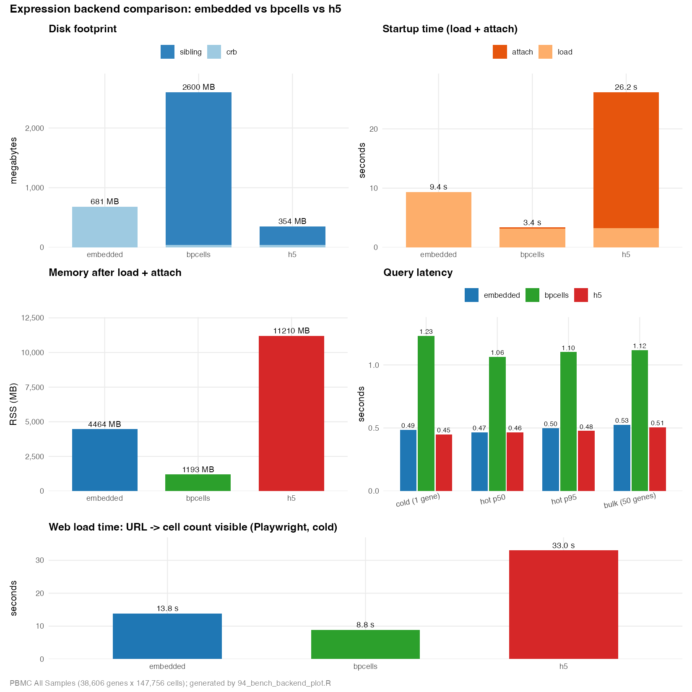

```{r, include = FALSE}
knitr::opts_chunk$set(
  collapse = TRUE,
  comment = "#>",
  eval = FALSE
)
```

# Overview

`exportFromSeurat()` and `convertSeuratToCerebro()` can persist the expression matrix in one of three modes via `expression_matrix_mode`: `"embedded"` (default — matrix lives inside the `.crb`), `"bpcells"` (BPCells on-disk matrix in a sibling `<stem>.bpcells/` directory), or `"h5"` (sparse CSC HDF5 in a sibling `<stem>.h5` file). The same crb can therefore expand into very different on-disk footprints, startup costs, and runtime memory profiles, and the right choice depends on what you optimise for.

This vignette walks through a controlled comparison of all three on a single fixture, summarises the trade-offs, and points at the underlying scripts so the experiment can be reproduced once the source data is available.

# Data

The benchmark target is an internal Seurat integration of a PBMC TCR/BCR study (STACAS-integrated, ~5.9 GB on disk in `.qs` form). The fixture itself is not redistributable, so it lives outside the package and is read by the conversion scripts in `tests/smoke/`. Key dimensions after conversion:

| field | value |
|---|---|
| genes | 38,606 |
| cells | 147,756 |
| assay | `RNA` |
| slot | `counts` |
| organism | Human PBMC |
| groups | `celltype_merged.l1`, `timepoint`, `sample` |
| sparsity | high (typical scRNA-seq counts) |

The dataset is intentionally large enough that the three backends pull apart on every axis we measure. Smaller fixtures (e.g. `inst/extdata/v1.4/example.crb`) compress the differences too aggressively to be informative.

# What the benchmark measures

For each backend the script measures:

| metric | what it captures |
|---|---|
| `disk_crb_mb` | size of the `.crb` itself |
| `disk_sibling_mb` | size of the external sibling (NA for `embedded`) |
| `load_secs` | `readRDS()` of the `.crb` file — pure deserialisation of the metadata/projections/etc. plus, for `embedded`, the expression matrix itself |
| `attach_secs` | `.attachExternalExpression()` — for `embedded` it just validates the backend tag and returns; for `bpcells` it opens a lazy `IterableMatrix` handle on the sibling directory; for `h5` it currently `h5read`s the entire sparse matrix into RAM and rebuilds a `dgCMatrix` (which is why the number is large) |
| `rss_mb` | process resident-set size after load + attach |
| `cold_secs` | first single-gene full-row read after attach |
| `hot_p50_secs` / `hot_p95_secs` | 30 single-gene reads rotating through a 50-gene pool |
| `bulk_secs` | densified 50-gene × all-cells slice (the `marker_genes` tab pattern) |

Each backend runs in a **fresh R subprocess** via `callr::r()`, so the RSS reading for one backend is not polluted by the matrix left over from the previous backend. Reads go through the class accessors `getExpressionRow()` / `getExpressionBlock()` — the same code path the Shiny server uses — so the comparison reflects realistic runtime cost rather than raw `dgCMatrix` indexing.

# Running it locally

Both scripts live under `tests/smoke/src/` and read fixtures from `tests/smoke/data/` (paths relative to `tests/smoke/`). Run the converters first (each writes into its own `tests/smoke/result/...` subdirectory), then the bench, then the plot helper:

```{r}
# from tests/smoke/
Rscript src/10_convert_embedded.R
Rscript src/11_convert_bpcells.R
Rscript src/12_convert_h5.R
Rscript src/93_bench_backend_compare.R
Rscript src/94_bench_backend_plot.R
```

The bench produces `result/93_bench_backend_compare/summary.csv` and `run.log`. The plot helper consumes the CSV and writes `summary.png` and `summary.pdf` to the same directory.

# Results

Numbers below were captured on PBMC All Samples (38,606 genes × 147,756 cells), each backend in its own fresh R subprocess. Smaller is better in every column.

| metric | embedded | bpcells | h5 |
|---|---:|---:|---:|
| disk_crb_mb | 681 | 43 | **42** |
| disk_sibling_mb | — | 2,557 | 311 |
| **disk_total_mb** | 681 | 2,600 | **354** |
| load_secs | 9.3 | 3.2 | 3.2 |
| attach_secs | 0.02 | 0.20 | 22.9 |
| **startup_total_secs** | 9.4 | **3.4** | 26.2 |
| **rss_mb** | 4,464 | **1,193** | 11,210 |
| cold_secs | 0.49 | 1.23 | **0.45** |
| hot_p50_secs | 0.47 | 1.06 | **0.46** |
| hot_p95_secs | 0.50 | 1.10 | **0.48** |
| bulk_secs (50 × ncells) | 0.53 | 1.12 | **0.51** |

The same data, plotted (four panels on a single page — disk, startup, memory, latency):

{width=100%}

# Web load time (what the user actually sees)

The numbers above are server-side and only count the R-level work. The number that matters in practice is what a user perceives in the browser: from the moment they open the app URL to the moment the dataset is actually usable on screen.

For each backend a single-dataset PBMC Shiny app was generated with `createTraditionalShinyApp()`, launched on `127.0.0.1`, and opened in a headless Chrome via Playwright. The page was navigated cold (fresh R process, fresh browser context, no warm caches). The clock starts at `performance.timing.navigationStart` and stops when the text "147,756" (the cell count) first appears on the page — that text is rendered by Shiny only after `data_set` reactive has loaded the `.crb` and called `getNumberOfCells()`, so it cleanly marks "dataset is ready".

| | embedded | bpcells | h5 |
|---|---:|---:|---:|
| TTFB (ms) | 44 | 41 | 37 |
| DOM ready (ms) | 108 | 95 | 90 |
| `load` event (ms) | 126 | 135 | 94 |
| **cell count visible (ms)** | **13,843** | **8,844** | **33,016** |

The TTFB / DOM-ready / `load` numbers are essentially identical across backends because they only depend on serving the static HTML + JS bundle. All the divergence shows up in the last row, where the Shiny session has to establish, the R server has to load the `.crb`, attach the external sibling if any, and emit the first reactive outputs.

The web ranking matches the bench:

- **bpcells (~9 s)** — wins because both load and attach are cheap; the matrix never materialises and the dataset is "ready" as soon as Shiny has spoken to the server once.
- **embedded (~14 s)** — pays its ~9 s `readRDS` plus a few seconds of Shiny session handshake and initial reactive evaluation.
- **h5 (~33 s)** — same Shiny handshake as the others, plus ~23 s of `attach` because the current runtime slurps the entire HDF5 file into a `dgCMatrix` before the session can serve anything.

So if you actually deploy this somewhere, **bpcells is the fastest "open URL → usable" experience by a wide margin**, with embedded a few seconds behind and h5 being roughly 4× slower until the attach is refactored to use a lazy reader. The browser does almost no work — the gap is entirely server-side, exactly as the bench predicted.

# Interpretation

**Disk** — `h5` wins on total disk (354 MB) because the CSC arrays compress well inside HDF5; `bpcells` writes the largest payload because its packed format stores extra index structure per chunk. `embedded` sits in the middle. The `.crb` itself is tiny (~42 MB) for both external backends because it carries only metadata, projections, and trees plus a backend pointer — no expression matrix.

**Startup** — the total here is `load_secs + attach_secs`, and the split is what makes the three backends look so different:

- `embedded` spends almost all of its budget in `load_secs` (~9 s) because the matrix is *inside* the `.crb` and `readRDS()` has to deserialise the whole thing. `attach` is effectively free (0.02 s) — there is nothing external to attach, the helper just confirms the backend tag.
- `bpcells` has a small `load_secs` (~3 s, the `.crb` is only metadata) and a small `attach_secs` (~0.2 s). The reason `attach` stays cheap is that `open_matrix_dir()` only opens file handles on the sibling directory; no expression data is read until a query needs it.
- `h5` has the same small `load_secs` as `bpcells`, but `attach_secs` is ~23 s because the current runtime reads every HDF5 dataset (`data`, `indices`, `indptr`, `shape`, `genes`, `barcodes`) and rebuilds a `dgCMatrix` in memory. That cost scales linearly with matrix size and dominates everything else on this fixture.

Net effect: `bpcells` wins startup overall (~3.4 s), `embedded` is in the middle (~9.4 s), `h5` is far behind (~26 s). The `h5` number is implementation-driven, not protocol-driven — switching to a lazy `HDF5Array` reader at attach time would collapse it to the same range as `bpcells`.

**Memory** — `bpcells` is by far the lightest (1.2 GB RSS) because the matrix never fully materialises; queries stream from disk. `embedded` keeps the full sparse matrix in memory (~4.5 GB on this fixture). `h5` is the heaviest (~11 GB) because the current attach inflates a `dgCMatrix` *in addition to* the buffers from `rhdf5::h5read`; both linger after attach.

**Query latency** — once attached, `h5` and `embedded` are basically tied (~0.45 s per single-gene read, ~0.5 s for the 50-gene bulk slice) because both are operating on an in-memory `dgCMatrix`. `bpcells` is 2-3× slower because every read has to densify from disk-resident chunks.

# When to pick what

- **embedded** — single dataset, RAM plentiful, you do not want to think about siblings. Loads in 9 s, queries are fast, but every loaded copy holds the full matrix in RAM.
- **bpcells** — RAM-constrained host (container, shared server), willing to accept ~1 s per gene query. Disk is the largest of the three but only paid once per dataset.
- **h5** — minimum on-disk footprint, fastest queries once loaded. Today the attach step makes it the wrong choice for short-lived processes; it pays off only when one R process serves many queries against the same dataset. A future change to use `HDF5Array` for lazy reads at attach time would close that gap and likely make `h5` the all-round winner.

# Reproducing on your own data

`tests/smoke/src/93_bench_backend_compare.R` is parameter-free — it reads the three PBMC `.crb` files produced by scripts 10/11/12. To bench a different dataset, copy the script, swap the three `crb` / `sibling` paths in the `backends` list at the top, and rerun. The script gracefully skips backends whose `.crb` is missing, so partial setups (e.g. only embedded and h5) work too.

```{r}
backends <- list(
  embedded = list(
    crb     = "result/10_convert_embedded/cerebro_my_dataset.crb",
    sibling = NULL
  ),
  bpcells = list(
    crb     = "result/11_convert_bpcells/cerebro_my_dataset.crb",
    sibling = "result/11_convert_bpcells/cerebro_my_dataset.bpcells"
  ),
  h5 = list(
    crb     = "result/12_convert_h5/cerebro_my_dataset.crb",
    sibling = "result/12_convert_h5/cerebro_my_dataset.h5"
  )
)
```

# Reference

- `tests/smoke/src/93_bench_backend_compare.R` — bench (callr-isolated, writes `summary.csv`)
- `tests/smoke/src/94_bench_backend_plot.R` — 4-panel plot helper (writes `summary.png` / `summary.pdf`)
- `tests/smoke/src/{10,11,12}_convert_*.R` — converters per backend
- `?exportFromSeurat`, `?convertSeuratToCerebro` — backend selection via `expression_matrix_mode`
